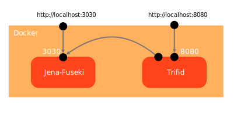

# Playground

This is a playground for people who want to get some hands-on experience with RDF and SPARQL.


## How to get started

First, clone this repository.

```bash
git clone https://github.com/zazuko/playground
```

Then change into the *playground* directory and start the services with `docker-compose`.
This will also download the necessary docker images.

```bash
cd playground
docker-compose up
```

## What's inside

Once the startup completed you can access the services.

| Service        | URL                   |
| ---------------|:---------------------:|
| Jena-Fuseki    | http://localhost:3030 |
| Trifid         | http://localhost:8080 |

A picture of what's inside. 


### Components
#### Jena-Fuseki

Jena-Fuseki is a triplestore with a SPARQL endpoint. A triplestore is a database specialized for in storing and retrieving triples.
A triple is a data entity composed of subject-predicate-object, like "Bob knows Fred".
SPARQL is an RDF query language, it is the mechanism we use to get data from the triplestore.

In this playground, Jena-Fuseki is the place where we store the data.

For more information, you can head over to the [Apache Jena-Fuseki Documentation](https://jena.apache.org/documentation/fuseki2/index.html)

#### Trifid

Trifid provides a lightweight and easy way to access Linked Data URIs via HTTP. In the Linked Data world this is often called "dereferencing".

In this playground, we use Trifid to get a human readable HTML representation of the data in our graph and we also use it to write SPARQL queries and run them on the triplestore.

For more information, you can head over to [Trifid on GitHub](https://github.com/zazuko/trifid)


### Let's fill our triplestore with data

The triplestore has a Web Interface. You can use it if you like.

| URL                   | User                  | Password |
| ----------------------|:---------------------:|:--------:|
| http://localhost:3030 | admin                 | admin   |

You can use the Web Interface but we don't use it in this tutorial. 

Instead, we will use Fuseki's [HTTP Administration Protocol](https://jena.apache.org/documentation/fuseki2/fuseki-server-protocol.html#datasets-and-services).


First we have to create a Dataset. To create a new Dataset run this `curl` command. 

```bash
  curl -X POST  \
       -u admin:admin \
       "http://localhost:3030/$/datasets?dbType=tdb&dbName=playground"
        
```
This creates a dataset called **playground**. A dataset is similar to a database. This is the place where we store our data.

Now let's fill this dataset with sample data. This data is based on the relations of the people from **The Big Bang Theory**.

```bash
 curl -X PUT \
     -H Content-Type:application/n-triples \
     -T sample-data/1_data.nt \
     -G http://localhost:3030/playground \
     -d default
```

Go to this URL http://localhost:8080/data/person/sheldon-cooper to see if everything is working. What you should see now is **trifid** showing you a HTML view of the data stored for **Sheldon Cooper**.


## SPARQL

Now let's try a few SPARQL queries. 
SPARQL is a query language for RDF. To be precise, it is a semantic query language for triplestores, allowing us to retrieve and manipulate data stored as RDF.

Go to http://localhost:8080/sparql/ and let's try a few queries.

[Try this Query](http://localhost:8080/sparql/#query=SELECT+%3Fsubject+%3Fpredicate+%3Fobject%0AWHERE+%7B%0A++%3Fsubject+%3Fpredicate+%3Fobject+.%0A%7D%0ALIMIT+50&contentTypeConstruct=text%2Fturtle&contentTypeSelect=application%2Fsparql-results+json&endpoint=http%3A%2F%2Flocalhost%3A8080%2Fquery&requestMethod=POST&tabTitle=Query&headers=%7B%7D&outputFormat=table)

```sparql
SELECT ?subject ?predicate ?object
WHERE {
  ?subject ?predicate ?object .
}
LIMIT 50
```

This gets us 50 triples from our triplestore. 

### Get the given name and family name of Stuart Bloom

[Try this Query](http://localhost:8080/sparql/#query=PREFIX+schema%3A+%3Chttp%3A%2F%2Fschema.org%2F%3E%0A%0ASELECT+%3FfirstName+%3FlastName%0AWHERE+%7B%0A++%3Chttp%3A%2F%2Flocalhost%3A8080%2Fdata%2Fperson%2Fstuart-bloom%3E+schema%3AgivenName+%3FfirstName+.%0A++%3Chttp%3A%2F%2Flocalhost%3A8080%2Fdata%2Fperson%2Fstuart-bloom%3E+schema%3AfamilyName+%3FlastName+.%0A%7D&contentTypeConstruct=text%2Fturtle&contentTypeSelect=application%2Fsparql-results+json&endpoint=http%3A%2F%2Flocalhost%3A8080%2Fquery&requestMethod=POST&tabTitle=Query&headers=%7B%7D&outputFormat=table)

```sparql
PREFIX schema: <http://schema.org/>

SELECT ?firstName ?lastName
WHERE {
  <http://localhost:8080/data/person/stuart-bloom> schema:givenName ?firstName .
  <http://localhost:8080/data/person/stuart-bloom> schema:familyName ?lastName .
}
```

### People Stuart Bloom knows

[Try this Query](http://localhost:8080/sparql/#query=PREFIX+schema%3A+%3Chttp%3A%2F%2Fschema.org%2F%3E%0A%0ASELECT+%3FfirstName+%3FlastName%0AWHERE+%7B%0A++%3Chttp%3A%2F%2Flocalhost%3A8080%2Fdata%2Fperson%2Fstuart-bloom%3E+schema%3Aknows+%3Ffriend+.%0A++%3Ffriend+schema%3AgivenName+%3FfirstName+.%0A++%3Ffriend+schema%3AfamilyName+%3FlastName+.%0A%7D&contentTypeConstruct=text%2Fturtle&contentTypeSelect=application%2Fsparql-results+json&endpoint=http%3A%2F%2Flocalhost%3A8080%2Fquery&requestMethod=POST&tabTitle=Query&headers=%7B%7D&outputFormat=table)

```sparql
PREFIX schema: <http://schema.org/>

SELECT ?firstName ?lastName
WHERE {
  <http://localhost:8080/data/person/stuart-bloom> schema:knows ?friend .

  ?friend schema:givenName ?firstName .
  ?friend schema:familyName ?lastName .
}
```

But wait! This solution shows only 6 friends, but actually **Stuart Bloom** has 7 friends.

**Penny** is our problem. Our data only contains her **givenName**, but not her **familyName**.

Let's go ahead and define both name properties as optional.

[Try this Query](http://localhost:8080/sparql/#query=PREFIX+schema%3A+%3Chttp%3A%2F%2Fschema.org%2F%3E%0A%0ASELECT+%3FfirstName+%3FlastName%0AWHERE+%7B%0A++%3Chttp%3A%2F%2Flocalhost%3A8080%2Fdata%2Fperson%2Fstuart-bloom%3E+schema%3Aknows+%3Ffriend+.%0A++OPTIONAL+%7B%3Ffriend+schema%3AgivenName+%3FfirstName%7D+.%0A++OPTIONAL+%7B%3Ffriend+schema%3AfamilyName+%3FlastName%7D+.%0A%7D&contentTypeConstruct=text%2Fturtle&contentTypeSelect=application%2Fsparql-results+json&endpoint=http%3A%2F%2Flocalhost%3A8080%2Fquery&requestMethod=POST&tabTitle=Query&headers=%7B%7D&outputFormat=table)

```sparql
PREFIX schema: <http://schema.org/>

SELECT ?firstName ?lastName
WHERE {
  <http://localhost:8080/data/person/stuart-bloom> schema:knows ?friend .

  OPTIONAL {?friend schema:givenName ?firstName} .
  OPTIONAL {?friend schema:familyName ?lastName} .
}
```

With this modified query, the result also includes **Penny**.

### People who live in apartment 4a

[Try this Query](http://localhost:8080/sparql/#query=PREFIX+schema%3A+%3Chttp%3A%2F%2Fschema.org%2F%3E%0A%0ASELECT+%3FfirstName+%3FlastName%0AWHERE+%7B%0A++%3Fsubject+schema%3AgivenName+%3FfirstName+.%0A++%3Fsubject+schema%3AfamilyName+%3FlastName+.%0A++%3Fsubject+schema%3Aaddress+%3Faddr+.%0A++%3Faddr+schema%3AstreetAddress+%222311+North+Los+Robles+Avenue%2C+Apartment+4A%22+.%0A%7D&contentTypeConstruct=text%2Fturtle&contentTypeSelect=application%2Fsparql-results+json&endpoint=http%3A%2F%2Flocalhost%3A8080%2Fquery&requestMethod=POST&tabTitle=Query&headers=%7B%7D&outputFormat=table)

```sparql
PREFIX schema: <http://schema.org/>

SELECT ?firstName ?lastName
WHERE {
  ?subject schema:givenName ?firstName .
  ?subject schema:familyName ?lastName .
  ?subject schema:address ?addr .

  ?addr schema:streetAddress "2311 North Los Robles Avenue, Apartment 4A" .
}
```

### People with the job title neurobiologist

[Try this Query](http://localhost:8080/sparql/#query=PREFIX+schema%3A+%3Chttp%3A%2F%2Fschema.org%2F%3E%0A%0ASELECT+%3FfirstName+%3FlastName%0AWHERE+%7B%0A++%3Fsubject+schema%3AgivenName+%3FfirstName+.%0A++%3Fsubject+schema%3AfamilyName+%3FlastName+.%0A++%3Fsubject+schema%3AjobTitle+%22neurobiologist%22+.%0A%7D&contentTypeConstruct=text%2Fturtle&contentTypeSelect=application%2Fsparql-results+json&endpoint=http%3A%2F%2Flocalhost%3A8080%2Fquery&requestMethod=POST&tabTitle=Query&headers=%7B%7D&outputFormat=table)

```sparql
PREFIX schema: <http://schema.org/>

SELECT ?firstName ?lastName
WHERE {
  ?subject schema:givenName ?firstName .
  ?subject schema:familyName ?lastName .
  ?subject schema:jobTitle "neurobiologist" .
}
```